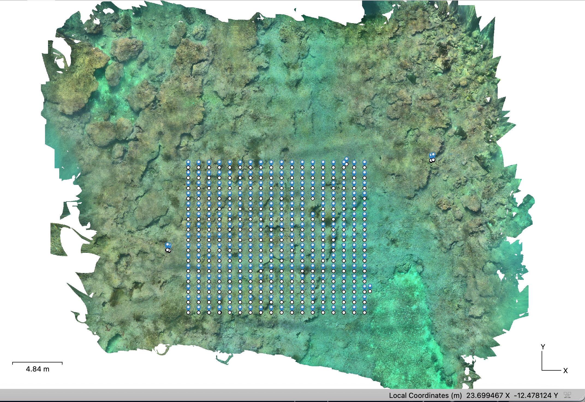
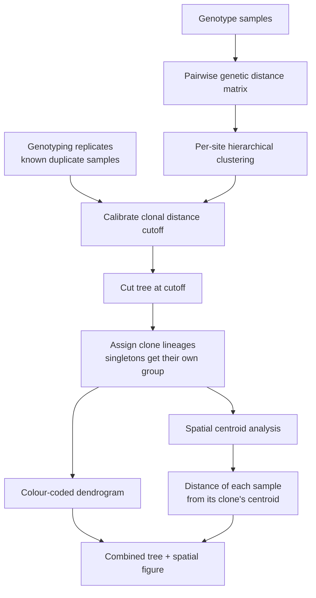

# Grid Projection in Metashape Pro

Repository for the workflow presented in **van Hulten et al. (in prep)** 

This workflow supports the creation of **spatially explicit sampling designs** for locally dominant or monostand-forming marine organisms. It uses Structure-from-Motion (SfM) photogrammetry in [Agisoft Metashape Pro](https://www.agisoft.com/) to reconstruct a 3D model of a reef area, then projects a regular grid of sampling points onto that model — giving a systematic, spatially referenced sampling scheme across dense, boundary-less coral stands that would otherwise be very difficult to sample rigorously.

---

## Repository contents

| File | Description |
|---|---|
| `project_grid_metashape.py` | Metashape Python script that generates a grid of markers projected onto a point cloud or mesh, within a bounding box defined by markers or the current region. |
| `images/` | Example figures referenced in this README. |
| `LICENSE` | GNU General Public License v3.0. |

---

## Requirements

- [Agisoft Metashape Pro](https://www.agisoft.com/) ≥ version **2.2.1**
- PySide2 (bundled with Metashape Pro's Python environment — no separate install needed)
- No external Python dependencies beyond the Metashape Python API for `project_grid_metashape.py`

---

## Workflow

1. **Import images** into Agisoft Metashape Pro (≥ version **2.2.1**) and align photos.
2. **Check alignment** and build a **dense cloud**.
3. **Scale the model** with scale bars and align the **z-axis** with the gravitational up vector by assigning a z value to ground control points.
4. *(Optional)* Build the **DEM** and **Orthomosaic** for higher resolution imagery.
   - Best results for orthomosaics are based on the **DEM**, not the point cloud.

5. Run the script:
   - `Tools -> Run Script...`
   - Select **`project_grid_metashape.py`**
   - Leave arguments blank.
6. **Choose parameters** in the dialog:
   - **Spacing** — distance between grid points in meters (float).
   - **Target region** — either the full region or a sub-area defined by 4 markers (`TL`, `TR`, `BL`, `BR`).
   - **Select by shape** - either select a predefined polygon or draw a new shape to limit the spatial distribution of grid points.
   - **Source** — whether to use the **Point Cloud** or the **Mesh** for point projection.

   Example result:

   

---

## Notes

- No external dependencies are required beyond Metashape Pro's bundled Python environment.
- The script automatically **saves your project** after each run.
- On repeated runs, previously projected grid markers (`G_###`) are deleted.
  - If you want to keep markers, **save or rename them** before re-running.

---

# Post-collection workflow: clonal assessment & spatial distribution

Once samples are collected in the field (see the [field sampling workflow](#)), this stage of the pipeline takes genotyped samples and determines
which ones are clonal replicates of the same individual (ramets of one genet),
then examines how tightly those clones are clustered in space.

This part of the workflow uses the Spatial_analysis_of_genotype distributions.R script

## Overview

## 1. Input data

- **Genetic distance matrix** — a pairwise identity-by-state (IBS) matrix
  computed from SNP genotypes (e.g. via ANGSD), with one row/column per
  sample.
- **Sample metadata** — site/location codes, and the spatial position of each
  sample (world coordinates from the photogrammetry/orthomosaic pipeline used
  during collection).
- **Known genotyping replicates** *(optional but recommended)* — pairs of
  samples that were deliberately re-extracted/re-sequenced from the same
  physical sample. These act as a positive control for "this is definitely
  one individual," and are used to sanity-check the clustering threshold
  rather than to assign clones themselves.

## 2. Per-site exploratory clustering

Samples are split by site/location and hierarchically clustered on genetic
distance (average linkage). Plotting each site's dendrogram separately, with
a candidate cutoff line overlaid gives a first visual read on whether the 
threshold produces a sensible number of distinct clusters per site before
committing to a value.

## 3. Choosing a clonal distance cutoff

A single distance threshold is used to decide "close enough in genetic
distance to be the same clone." Two lines of evidence support the chosen
cutoff:

1. **Known replicate pairs** — plotting these on the full dendrogram (e.g.
   highlighted in a different colour) confirms that true replicates fall
   well below the candidate threshold.
2. **Overall distance distribution** — a histogram of all pairwise distances
   in the tree typically shows a gap or shoulder separating "within-clone"
   distances from "between-individual" distances; the cutoff is placed in
   that gap.

## 4. Assigning clone lineages

The tree is cut at the chosen threshold, producing one group per cluster.
Groups containing only a single sample (singletons) are pooled into a shared
placeholder group for plotting purposes, but are still tracked as distinct
individuals for any downstream modelling — they're only merged visually, not
statistically.

## 5. Spatial centroid analysis

For each assigned clone lineage with more than one sample, the centroid of
all its sample positions are calculated in 3D world space, and each sample's
distance from that centroid is recorded. This gives a per-clone measure of
spatial spread — how far apart, physically, the ramets of a single genetic
individual tend to be found.

## 6. Combined visualization

The final figure pairs two panels sharing a vertical axis, ordered by clone
lineage:

- **Left** — the genetic dendrogram, branches coloured by assigned clone
  lineage.
- **Right** — each sample's distance from its clone's spatial centroid,
  plotted against the same lineage ordering, so genetic clustering and
  spatial clustering can be read side by side for the same set of clones.

## 7. Spatial distribution of genotypes

Using the orthomosaics generated in Agisoft Metashape-Pro, map the spatial
distribution of genotypes.

## Outputs

- Dendrogram(s) coloured by clone lineage, per site and combined across all
  sites, exported as vector graphics for figure use.
- Histogram of pairwise genetic distances with the chosen cutoff marked.
- Combined tree + spatial-distance figure.
- An updated sample metadata table with an assigned clone lineage per
  sample, ready for use in downstream population-level analyses.

## Tools used

Clustering and visualization are built primarily in R, using `hclust` for
clustering, `dendextend`/`sparcl` for coloured dendrograms, `ggtree` for
tree plotting, and `ggplot2`/`patchwork` to combine the genetic and spatial
panels into one figure.

---

*Add a link above to the field collection workflow page, and adjust file
paths/thresholds in the linked scripts to match your dataset.*

## Citation

If you use this workflow in your research, please cite:

> van Hulten, D., Yuval, M., Liggins, L., Sewell, M. A., & Bongaerts, P. (in prep). *[Full paper title]*. [DOI/link once published]

A citable, versioned snapshot of this repository is also available via Zenodo: [DOI badge/link once archived]

---

## License

This repository is released under the [GNU General Public License v3.0 (GPL-3.0)](LICENSE).

## Contact

Questions or issues? Open a [GitHub Issue](../../issues) or contact Dennis van Hulten at dvanhulten@calacademy.org.
